<!--
canonical: docs-src/feature-stage-pack.md
html-export: ../feature-stage-pack.html
audience: Vlad, prospective investors, product reviewers
owner: Razim Wasti
status: current
last-reviewed: 2026-07-17
confidentiality: shareable product roadmap
-->

# Fieldstate Feature Stage Pack

## Purpose

This pack is the **product and engineering contract** for Fieldstate's staged roadmap. For each stage it states:

1. **What a user can do** — screens, workflows, and outputs.
2. **What engineering must ship** — APIs, models, evidence artifacts, and QA.
3. **What evidence must pass** before the stage is investor- or customer-facing.
4. **What funding unlocks** the next stage and why.

The staging is deliberately conservative. **Built today**, **funded next**, and **future ambition** are separated so Fieldstate can be presented credibly without implying that neural sports intelligence or live tracking already exist.

Stage-specific inspiration and resource notes live in [`stage-resources/`](../stage-resources/). Use those folders for screenshots, sketches, and public-safe references — inspiration is not a capability claim.

Related documents:

| Document | Role |
|---|---|
| [Investor Pack v2](investor-pack-v2.md) | Commercial narrative and **canonical stage budgets** |
| [MVP Scope](mvp-v2-scope.md) | Acceptance criteria for the first funded sprint |
| [Model Evidence Explainer](model-evidence.md) | How numbers are verified (no hand-typed metrics here) |
| [Engineering Overview](engineering-overview.md) | Stack, repo map, evaluation discipline |

## How product stages map to funding

Product stages (1–5) describe **capability**. Commercial funding stages in the investor pack describe **budget and deliverables**. They align but are not identical — one funding cheque may complete part of a product stage, or bridge two.

| Product stage | Primary user outcome | Typical funding stage(s) | Indicative budget (see investor pack) |
|---|---|---|---|
| **1 — Current Evidence Demo** | Credible real-data analyst demo | Feasibility Sprint (partially self-funded to date) | £15k–£30k fixed + retainer |
| **2 — MVP Pilot Sprint** | Repeatable pilot workflow + first paid conversation | Feasibility Sprint completion → Pilot-Ready Product | £30k–£60k |
| **3 — Data-Rich Decision Intelligence** | Licensed-data analyst tool | Expanded Model-Lab → Data & Validation | £60k–£250k+ |
| **4 — Set-Piece and Specialist Modules** | Penalty, corner, free-kick and rehearsal workflows | Data & Validation → Proprietary Data Creation | £100k–£350k+ |
| **5 — Full What-If Engine** | Full decision operating system with neural/tracking layers | Scaled Product Platform | £250k–£750k+ |

## Product principle

Fieldstate helps users move from **what happened** → **what else was available** → **what may happen if the decision changes**.

Player Portal turns coaching conversations into trackable reflection and improvement loops. It supports face-to-face coaching; it does not replace it.

| Label | Meaning | Visual treatment |
|---|---|---|
| **Fact** | Recorded event or observed freeze-frame/tracking data | Solid lines, primary palette |
| **Estimate** | Modelled probability, value, risk, or momentum | Amber / secondary, always tagged |
| **Hypothetical** | User-edited decision or simulated branch | Dashed violet, never styled as recorded |

Every estimate shown in the product must carry **provenance** (`recorded | derived | heuristic | learned_gated`) and link to an evidence artifact where applicable.

## Cross-cutting engineering standards

These apply at **every** stage:

- **Frozen evidence artifacts** — investor-facing numbers are commit-pinned JSON, served from `/evidence/*/frozen`, never live-recomputed on demo day.
- **Pre-registered gates** — breadth, calibration, held-out competition, and delta CIs are written before evaluation runs; `product_ready: false` means the UI must not show the model as commercial-grade.
- **No future labels in scenarios** — descriptive outcome labels (e.g. shot-within-10s) never become scenario input features.
- **Session audit trail** — each funded delivery increment is logged in [`sessions/`](../sessions/) with decisions, validation, and known setbacks.
- **Public/private separation** — negotiation strategy and rights memos stay in `field-state-private/`; this repo stays public-safe.

---

## Stage 1 — Current Evidence Demo

**Status: largely built — polish and walkthrough rehearsal remain**

### Product: what the user does

| Feature | User experience | Provenance |
|---|---|---|
| **Match & moment picker** | Browse real professional matches; select a curated or showcase pass/carry moment | Fact |
| **Pass-chain replay** | Step through the recorded chain with pitch SVG and optional animation timeline | Fact |
| **360 visibility** | See camera-visible players on freeze-frame moments where 360 data exists | Fact (with coverage caveat) |
| **Visible pass options** | View derived passing options on 360-covered moments | Derived |
| **Counterfactual edit** | Drag or specify an alternative pass/carry endpoint | Hypothetical |
| **Scenario comparison** | Side-by-side original vs edited decision with heuristic value/risk/plausibility | Heuristic + hypothetical |
| **Evidence page** | Read gate status, artifact commit, and what is safe to claim | Fact (about the system) |
| **Assigned player moment** | Player reviews one assigned pass moment, sees coach/analyst note, compares actual vs alternative, and adds a short reflection | Fact + note + hypothetical |

**Primary user journeys**

1. *Investor walkthrough* — landing → marquee moment → replay → one counterfactual edit → evidence page.
2. *Analyst spot-check* — pick match → showcase event → inspect pass chain completeness and 360 badge.
3. *Technical diligence* — call frozen evidence endpoints; reproduce artifact at pinned commit.

### Engineering: what is shipped

| Layer | Deliverable | Location / surface |
|---|---|---|
| **Data** | StatsBomb open event + 360 cache; match/event loaders | `fieldstate-models` data layer |
| **Scenario engine** | Deterministic counterfactual comparison | `POST /scenario`, SVG renderers |
| **Pass chain** | Chain builder, evaluation, animation timeline | `/pass-chain*`, `/pass-chain/timeline.json` |
| **Demo shell** | Landing, match strip, moment pages | `/demo`, `/demo/matches/*`, `/demo/moments/*` |
| **Replay UI** | Stepping controls, outcome chips | Demo moment replay fragment |
| **Counterfactual UI** | Edit interaction wired to `/scenario` | Demo counterfactual fragment |
| **Evidence** | Frozen pass-option + pass-completion artifacts | `/evidence/*/frozen`, `/demo/evidence` |
| **Evaluation (internal)** | Pass-chain, pass-option, pass-completion, label experiments | `/evaluations/*` |
| **Momentum (internal)** | Match momentum report API — heuristic, not product-gated | `GET /matches/{id}/momentum` |
| **Tests** | Pytest suite covering API, scenarios, demo shell, provenance tags | `fieldstate-models/tests/` |

Build history: Sessions 001–025 (see [`sessions/`](../sessions/)).

### Evidence & acceptance gates (Stage 1 complete when…)

- [x] Real professional match data loads and renders without synthetic fallback.
- [x] Pass-chain replay works on curated demo moments with honest 360 coverage copy.
- [x] Counterfactual `/scenario` returns structured metrics with provenance tags.
- [x] Frozen evidence artifacts exist and are served from committed JSON.
- [x] Pass-completion model evaluated at scale with calibration documented in frozen artifact *(metrics: see artifact, not this doc)*.
- [ ] Rehearsed 30-minute walkthrough script with two backup moments tested on clean machine.
- [ ] Manual SVG spot-check sign-off on all externally quoted demo moments.

### What Stage 1 does **not** claim

- Live tracking ingestion or continuous player movement.
- Neural sequence simulation or multi-action branches.
- Commercial accuracy guarantees on pass-completion probability in the scenario UI *(gate may pass internally before UI wiring)*.
- Full-match tactical intelligence or automated coaching recommendations.
- Messaging integrations, chat workflows, set pieces, tracking simulation, 3D modelling, or neural scenario engines.

### Unlock for Stage 2

Stage 1 is the credibility floor. Stage 2 funding buys **product hardening**: curated moment library, gated model wiring, exportable reports, hosted demo, and QA — not new science from scratch.

---

## Stage 2 — MVP Pilot Sprint

**Status: partially built — funded sprint closes the pilot-ready gap**

### Product: what the user does

| Feature | User experience | Provenance |
|---|---|---|
| **Polished moment viewer** | Production-quality layout, responsive replay, consistent typography and pitch visual language | Fact + UX |
| **Saved demo library** | Repeatable walkthroughs across N curated matches; no ad-hoc event hunting | Fact |
| **Original vs edited panel** | Clear diff: recorded chain vs hypothetical branch with metric deltas | Fact + hypothetical |
| **Gated pass-completion probability** | Completion % shown only when frozen artifact reports `product_ready: true` | `learned_gated` |
| **Possession value & turnover risk** | Plain-language explanation of value/risk change under edit | Heuristic / gated |
| **Evidence badges** | Every metric chip labelled fact / estimate / hypothetical | UX contract |
| **Exportable analyst report** | PDF or HTML export: moment summary, visuals, metrics, caveats, artifact commit | Mixed |
| **Offline demo snapshot** | Static export for conferences or data-room review without live server | Fact about export |
| **Player dashboard** | Assigned clips, coach notes, player replies/reflections, personal goals, and progress history | Fact + note + estimate |

**Primary user journeys**

1. *Club pilot preview* — analyst receives link → walks three prescribed moments → exports report.
2. *Investor re-demo* — same flow as Stage 1 but polished, gated, and exportable.
3. *Partner technical review* — API + export + evidence page with reproduction instructions.

### Engineering: what must ship

| Workstream | Deliverable | Acceptance signal |
|---|---|---|
| **UI polish** | Unified design system across demo pages; mobile-safe pitch SVG | Design review + visual regression on curated moments |
| **Moment manifest v2** | Expanded curated library with narratives, 360 flags, walkthrough order | JSON manifest versioned in repo |
| **Gated model wiring** | `completion_probability` on `/scenario` only when frozen gate passes | Unit test: gate false → field absent; gate true → field present with provenance |
| **Scenario deltas** | Momentum / danger delta under counterfactual edit (heuristic track) | API fields + UI chips with caveats |
| **Report generator** | Server-side HTML/PDF export from moment + scenario + evidence metadata | Export matches on-screen numbers exactly |
| **Player Portal v1** | Club-licensed follow-up layer for assigned moments, notes, reflections, and goals | Stage 1 assigned moment evolves into repeatable pilot workflow |
| **Demo hosting** | Deployed instance (or reproducible Docker) with env docs | Cold-start runbook; 99% uptime during pilot window |
| **QA & docs** | Test plan, known limitations page, pilot operator guide | Signed checklist before first external pilot |
| **AI analyst layer (optional)** | `fieldstate-ai` explain-scenario for JSON analyst narrative | Requires API key; clearly labelled as LLM synthesis |

### Evidence & acceptance gates (Stage 2 complete when…)

- [ ] Frozen pass-completion artifact reports `product_ready: true` *(or product explicitly ships without completion % and documents why)*.
- [ ] All demo surfaces respect provenance contract — no estimate rendered as fact.
- [ ] Exportable report quotes only artifact-pinned numbers.
- [ ] Three-match walkthrough completes in ≤30 minutes without engineer present.
- [ ] First **paid or formally LOI pilot** delivered *(commercial gate from investor pack)*.

### Dependencies

- Stage 1 demo shell, counterfactual flow, and evidence system *(built)*.
- Corpus breadth and calibration gates per pre-registered evaluation plan.
- Hosting budget and operator time during pilot window.

### What Stage 2 does **not** claim

- Licensed premium tracking data or broadcast-grade video sync.
- Player scouting scores or recruitment-grade profiles.
- Multi-action scenario trees.
- External messaging integrations such as Slack, Teams, club app, email, or WhatsApp Business.

### Unlock for Stage 3

First revenue signal or formal pilot LOI + evidence that gated models survive external analyst scrutiny. Funding shifts from **prove the shape** to **prove the data moat**.

---

## Stage 3 — Data-Rich Decision Intelligence

**Status: future funded — Tier F experiments prove direction, not product readiness**

### Product: what the user does

| Feature | User experience | Provenance |
|---|---|---|
| **Stronger pass/carry estimates** | Calibrated probabilities by competition cohort | `learned_gated` |
| **Receiver availability view** | Who was realistically available at decision time | Derived / gated |
| **Lane pressure overlay** | Defensive pressure on pass lane and target | Derived from 360 or tracking |
| **Momentum timeline** | Peak danger by minute with time decay — not diluted averages | Estimate |
| **Match room** | Team-level threat arcs: when and why danger was created | Estimate |
| **Player decision profile** | Aggregated choices across similar moments for one player | Estimate |
| **Player Portal trends** | Personal decision trends, similar-moment learning mode, role-specific benchmarks, and optional notifications | Estimate |
| **Competition-aware dashboards** | Filter by league, phase, home/away with coverage badges | Fact + estimate |

**Primary user journeys**

1. *Match analyst post-game* — scan momentum timeline → drill to peak moments → compare player profiles.
2. *Opposition scout* — filter decision profiles for press-resistant passing under lane pressure.
3. *Internal model review* — held-out competition report linked from Evidence Centre.

### Engineering: what must ship

| Workstream | Deliverable | Acceptance signal |
|---|---|---|
| **Data licensing** | Contracted event + tracking or premium 360 feed; ETL pipeline | Coverage report by competition |
| **Feature store v1** | Team shape, pressure, lane geometry, receiver openness features | Feature manifest + unit tests |
| **Challenger models** | Calibrated tree/boosting + cohort baselines; ablation vs Tier E/F | Held-out match + LOCO reports |
| **Momentum v2** | Supervised shot/goal-within-10s value model replacing heuristic proxy | Calibration gate on held-out set |
| **Profile aggregation** | Player/moment clustering with minimum sample thresholds | UI suppresses thin samples |
| **Player Portal v2** | Player-specific assignments, trend summaries, learning queues, and optional notification hooks | Integration flag stays future/pilot until club-approved |
| **Evidence expansion** | New frozen artifacts per model; Evidence Centre v2 | One artifact per commercial claim |
| **Football domain review** | External advisor sign-off on label rules and pressure semantics | Written review in sessions/ |

Internal research already demonstrates 360 lane-pressure uplift on the covered subset *(Session 025)* — Stage 3 productizes this only on licensed, contamination-audited data.

### Evidence & acceptance gates (Stage 3 complete when…)

- [ ] Licensed data rights documented and scoped for pilot commercial use.
- [ ] Leave-one-competition-out gates pass for each customer-facing model.
- [ ] Lane-pressure features audited for endpoint contamination on incomplete passes.
- [ ] Minimum sample thresholds enforced in UI — no profile from &lt;N moments.
- [ ] At least one **club-grade pilot** using licensed-data features in production workflow.

### Dependencies

- Stage 2 pilot workflow and evidence discipline.
- Data budget (£5k–£100k depending on scope — see cost brief).
- Part-time football domain advisor.

### What Stage 3 does **not** claim

- Full tracking at broadcast frame rate unless licensed and validated.
- Causal inference ("player X should have passed") — language stays probabilistic.
- Cross-club benchmarking without data-sharing agreements.

### Unlock for Stage 4

Licensed data pipeline operational + measured lift over open-data baselines on held-out competitions + commercial proof that analysts pay for depth.

---

## Stage 4 — Set-Piece and Specialist Modules

**Status: future funded — not started as product**

### Product: what the user does

| Feature | User experience | Provenance |
|---|---|---|
| **Penalty module** | Review penalty decisions, keeper tendencies, placement options, and rehearsal notes | Fact + estimate |
| **Corner module** | Compare delivery zones, runner roles, blocking context, and likely second-ball states | Fact + estimate |
| **Free-kick module** | Show delivery options, wall/keeper context, target zones, and set-play rehearsals | Fact + estimate |
| **Set-piece Player Portal** | Assign penalty/free-kick/corner role notes, player responses, and preparation checklists | Fact + note |
| **Specialist scenario lab** | Edit a set-piece choice and compare clearly hypothetical outcomes | Hypothetical |

### Engineering: what must ship

| Workstream | Deliverable | Acceptance signal |
|---|---|---|
| **Set-piece event schemas** | Penalty, corner and free-kick normalisation with roles and restart context | Fixture tests + data dictionary |
| **Specialist baselines** | Separate probability/value baselines for each set-piece type | Held-out reports per module |
| **Rehearsal assignments** | Coach/analyst assigns set-piece moments and role notes to players | Player Portal audit trail |
| **Scenario engine v2 prep** | Explicit divergence points and set-piece-specific caveats | Integration tests per module |
| **Module evidence cards** | One evidence artifact per set-piece claim | Evidence Centre links from every estimate |
| **Enterprise controls** | Club-level configuration for assignments, exports, and optional integrations | Role permissions + audit logs |

### Evidence & acceptance gates (Stage 4 complete when…)

- [ ] Penalty, corner and free-kick models each have separate gates and caveats.
- [ ] Set-piece hypothetical outputs remain visually distinct from recorded routines.
- [ ] Player rehearsal assignments are auditable and coach-controlled.
- [ ] Independent football-domain review of set-piece labels and role semantics.

### Dependencies

- Stage 3 licensed data, role labels, and set-piece event coverage.
- Club/domain input on penalty, corner and free-kick coaching workflows.
- Product engineering capacity for Player Portal assignments and permissions.

### What Stage 4 does **not** claim

- Neural full-match prediction or autonomous coaching.
- Live tracking or 3D player movement unless separately licensed and validated.
- Messaging integrations as default; they remain optional club-approved configuration.

### Unlock for Stage 5

Specialist modules create enough repeatable value to fund full scenario simulation, tracking/video integration, and neural sequence models.

---

## Stage 5 — Full What-If Engine

**Status: long-term funded ambition**

### Product: what the user does

The dream product is a **football decision operating system** organized into rooms:

| Room | User outcome |
|---|---|
| **Command Centre** | Ranked decision moments across match, week, player, or team |
| **Match Room** | Team threat, space, momentum, tactical context in one view |
| **Moment Replay** | Actual chain from event/tracking — fact mode only |
| **Counterfactual Lab** | Edit decisions; compare branches with confidence and caveats |
| **Evidence Centre** | Model cards, gates, calibration, coverage, provenance ledger |
| **Scout / Player Room** | Decision profiles and repeatable pattern analysis |
| **Player Portal** | Personal scenario sandbox, assigned moments, long-term development record, and coach-player feedback loop |
| **Media / Story Mode** | Explainable clips and graphics for broadcast or digital |

### Engineering: what must ship

| Workstream | Deliverable |
|---|---|
| **Platform shell** | Auth, workspaces, roles (analyst, coach, media, admin) |
| **Integrations** | Video platforms, club data warehouses, export APIs |
| **Player Portal enterprise** | Notes, reflections, assignments, preparation checklists, and optional club-approved messaging integrations |
| **Vision pipeline (optional)** | Licensed CV for tracking augmentation — only with validation |
| **Neural sequence engine** | Tracking/video-enriched pass, run, set-piece and possession scenario challengers with gates |
| **Synthetic data lab (optional)** | Augmented training data with explicit synthetic provenance |
| **Commercial infra** | Billing, SLA, multi-tenant isolation, audit logs |
| **Mobile / broadcast outputs** | Story mode renders, clip timing, brand-safe templates |

### Evidence & acceptance gates (Stage 5 complete when…)

- [ ] Platform passes security review for club data handling.
- [ ] Every room links to Evidence Centre for its estimates.
- [ ] Recurring revenue across ≥2 customer segments (club, media, or data partner).
- [ ] Model monitoring and refresh operational in production.

### Dependencies

- Stages 1–4 evidence stack and team scale-up (engineering, ML, design, commercial).
- Major data partnerships and legal/data-rights framework.
- CTO/ML leadership and dedicated infra.

---

## Master stage matrix

| Stage | User output | Engineering milestone | Data requirement | Model requirement | Evidence gate | Commercial use |
|---|---|---|---|---|---|---|
| **1 Demo** | Real moment replay, counterfactual edit, evidence page | Demo shell + frozen artifacts + pytest | Open event/360 | Deterministic + baseline ML | Artifacts exist; walkthrough rehearsed | Investor demo |
| **2 MVP** | Polished workflow, gated probability, export | Gated wiring + hosting + report export | Wider open data | Frozen pass-completion gate | `product_ready` + export parity | Paid pilot conversations |
| **3 Data-rich** | Momentum, pressure, profiles, match room | Licensed ETL + challenger models | Licensed event/tracking | Calibrated cohort models | LOCO + contamination audit | Club analyst workflow |
| **4 Set-piece** | Penalty, corner, free-kick and rehearsal modules | Set-piece schemas + Player Portal assignments | Licensed set-piece event/context data | Specialist baselines | Module gates + domain review | Specialist club workflow |
| **5 Full engine** | Full room suite, Player Portal, media mode | Platform + integrations + monitoring | Event + tracking + video | Monitored neural/model platform | Production SLA + revenue | Platform business |

## Delivery flow (engineering view)

```mermaid
flowchart LR
  subgraph S1["Stage 1 — Demo"]
    A1[Open data ingest]
    A2[Pass chain + scenario]
    A3[Frozen evidence]
  end
  subgraph S2["Stage 2 — Pilot"]
    B1[UI polish]
    B2[Gated model wiring]
    B3[Export + hosting]
  end
  subgraph S3["Stage 3 — Data-rich"]
    C1[Licensed data ETL]
    C2[Pressure + momentum v2]
    C3[Player profiles]
  end
  subgraph S4["Stage 4 — Set Pieces"]
    D1[Penalty module]
    D2[Corner + free-kick module]
    D3[Player rehearsal portal]
  end
  subgraph S5["Stage 5 — Full Engine"]
    E1[Product shell]
    E2[Neural + tracking layers]
    E3[Portal + media + API]
  end
  S1 --> S2 --> S3 --> S4 --> S5
```

## Risk controls

- **Fact stays solid** — recorded events and observations are visually separate from estimates.
- **Hypothetical stays dashed** — edited decisions never look like match footage or recorded data.
- **Every model has a gate** — probabilities require coverage, calibration, and held-out evidence before product display.
- **One home per number** — metrics live in frozen artifacts; docs explain methodology only.
- **Inspiration ≠ capability** — stage-resources inform design; they do not appear in sales claims.

## Stage resources

Inspiration, screenshots, sketches, and public-safe research notes are organised by development stage:

| Folder | Focus |
|---|---|
| [`stage-01-current-evidence-demo/`](../stage-resources/stage-01-current-evidence-demo/) | Demo, replay, scenario, evidence gates |
| [`stage-02-mvp-v2-pilot-sprint/`](../stage-resources/stage-02-mvp-v2-pilot-sprint/) | Pilot workflow, exports, walkthroughs |
| [`stage-03-data-rich-decision-intelligence/`](../stage-resources/stage-03-data-rich-decision-intelligence/) | Licensed data, pressure, momentum |
| [`stage-04-neural-spatial-sequence-engine/`](../stage-resources/stage-04-neural-spatial-sequence-engine/) | Tracking sequences, GPU models |
| [`stage-05-dream-product-platform/`](../stage-resources/stage-05-dream-product-platform/) | Platform rooms, commercial workflows |
| [`shared-references/`](../stage-resources/shared-references/) | Cross-stage design and model ideas |

## Recommended next step for reviewers

1. Read this pack for **stage intent and engineering seriousness**.
2. Request a **live Stage 1 walkthrough** on real matches.
3. Use the [Investor Pack v2](investor-pack-v2.md) for budgets and [MVP Scope](mvp-v2-scope.md) for sprint acceptance criteria.
